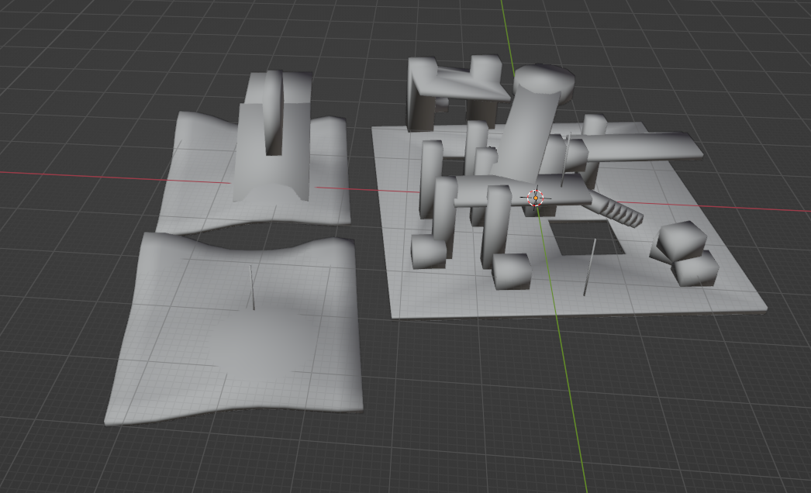
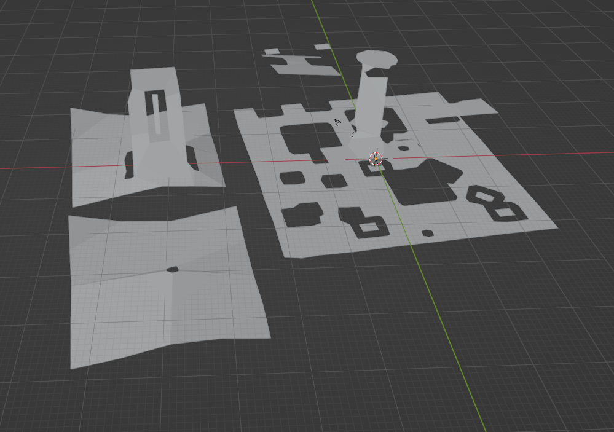

# RecastCLI


A command line tools to build navigation mesh for game, which means you can automatically generate navigation mesh on server or localhost in pipeline.

> Based on [recastCLI](https://github.com/but0n/recastCLI.js) under MIT license

----
# Command line tools

At master branch

## Building

* mkdir build
* cd build
* cmake ..
* make

## Usage

FROM:


TO:



```shell
$ ./RecastJS nav_test.obj 0 0 0 0 0 0 0 0 0 0 0 0 0 > navmesh.obj
```
 - Running at debug mode
 > Toggle with macro `#define DEBUG`


### Order

 - cellSize
 - cellHeight
 - agentHeight
 - agentRadius
 - agentMaxClimp
 - agentMaxSlope
 - regionMinSize
 - regionMergeSize
 - edgeMaxLen
 - edgeMaxError
 - vertsPerPoly
 - detailSampleDist
 - detailSampleMaxErro
